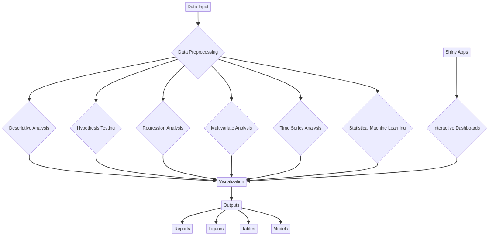

# Advanced Statistical Analysis R


# Advanced Statistical Analysis in R

## English

Advanced statistical analysis and data visualization platform developed in R, offering comprehensive implementations of modern statistical methods, predictive modeling, multivariate analysis, and interactive visualizations for scientific research and business data analysis.

## 🎯 Overview

A complete statistical analysis system that implements advanced methodologies including multivariate analysis, statistical modeling, hypothesis testing, regression analysis, time series, and statistical machine learning, with a focus on scientific rigor and practical applicability.

### ✨ Key Features

- **📊 Multivariate Analysis**: PCA, Factor Analysis, Cluster Analysis, MANOVA
- **📈 Statistical Modeling**: Linear/Logistic Regression, GLM, Mixed Models
- **🔍 Hypothesis Testing**: Parametric and non-parametric, multiple comparisons
- **⏱️ Time Series**: ARIMA, Decomposition, Forecasting, Spectral Analysis
- **🤖 Statistical Machine Learning**: Random Forest, SVM, Ensemble Methods
- **📋 Categorical Data Analysis**: Contingency tables, Log-linear models
- **🎛️ Interactive Visualizations**: Plotly, Shiny dashboards, advanced ggplot2

## 🛠️ Tech Stack

### Core Statistical Packages
- **R 4.3+**: Main statistical language
- **stats**: Base statistical functions
- **MASS**: Modern applied statistics
- **car**: Advanced regression analysis

### Data Manipulation & Visualization
- **dplyr**: Data manipulation
- **tidyr**: Data organization
- **ggplot2**: Statistical visualizations
- **plotly**: Interactive graphics

### Advanced Statistical Methods
- **psych**: Psychometric and multivariate analysis
- **cluster**: Cluster analysis
- **survival**: Survival analysis
- **forecast**: Time series analysis
- **randomForest**: Random Forest
- **e1071**: SVM and ML methods

### Specialized Analysis
- **vegan**: Ecological community analysis
- **lavaan**: Structural equation modeling
- **nlme**: Non-linear mixed-effects models
- **mgcv**: Generalized additive models

## 📁 Project Structure

### Architecture Diagram




```
Advanced-Statistical-Analysis-R/
├── R/                              # Main R scripts and core classes
│   ├── functions/                  # Organized R functions by category
│   │   ├── descriptive/            # Descriptive statistics functions
│   │   ├── inferential/            # Hypothesis testing and inference
│   │   ├── regression/             # Regression analysis functions
│   │   ├── multivariate/           # Multivariate analysis
│   │   ├── timeseries/             # Time series analysis
│   │   ├── machine_learning/       # ML algorithms and utilities
│   │   ├── visualization/          # Advanced plotting functions
│   │   └── utilities/              # Helper and utility functions
│   ├── statistical_analyzer.R      # R6 class for statistical analysis
│   └── visualization.R             # Core visualization functions
├── data/                           # Input data
│   ├── examples/                   # Example datasets
│   ├── processed/                  # Processed data
│   └── raw/                        # Raw data
├── docs/                           # Documentation
├── outputs/                        # Generated results
│   ├── figures/                    # Graphs and visualizations
│   ├── models/                     # Saved models
│   ├── reports/                    # Statistical reports
│   └── tables/                     # Statistical tables
├── shiny_apps/                     # Shiny applications
│   ├── multivariate_explorer/      # Multivariate explorer
│   ├── regression_analyzer/        # Regression analyzer
│   └── time_series_dashboard/      # Time series dashboard
├── tests/                          # Automated tests
├── .gitignore                      # Git ignore file
├── CODE_OF_CONDUCT.md              # Code of Conduct
├── CONTRIBUTING.md                 # Contributing guidelines
├── environment.yml                 # Conda environment configuration
├── LICENSE                         # Project license
├── README.md                       # Project documentation
├── requirements.R                  # R package requirements
└── statistical_analysis.R          # Main script to run analyses
```

## 🚀 Quick Start

### Prerequisites

- R 4.3 or higher
- RStudio (recommended)
- Rtools (Windows) or development tools (Mac/Linux)

### Installation

1. **Clone the repository:**
```bash
git clone https://github.com/galafis/Advanced-Statistical-Analysis-R.git
cd Advanced-Statistical-Analysis-R
```

2. **Install dependencies:**
```r
# Install necessary packages
install.packages(c(
  "dplyr", "ggplot2", "tidyr", "plotly", "shiny",
  "psych", "cluster", "survival", "forecast", "randomForest",
  "e1071", "car", "MASS", "vegan", "lavaan", "nlme", "mgcv"
))
```

3. **Run the analysis:**
```r
# Load and run main analysis
source("statistical_analysis.R")
```

4. **Explore the dashboards:**
```r
# Run multivariate Shiny application
shiny::runApp("shiny_apps/multivariate_explorer/")
```

## 📊 Detailed Functionalities

### 📈 Multivariate Analysis

```r
# Principal Component Analysis (PCA)
perform_pca_analysis <- function(data, scale = TRUE) {
  # Execute PCA
  pca_result <- prcomp(data, scale. = scale)
  
  # Calculate explained variance proportion
  variance_explained <- summary(pca_result)$importance[2, ]
  cumulative_variance <- summary(pca_result)$importance[3, ]
  
  # Create biplot
  biplot_pca <- ggplot2::autoplot(pca_result, 
                                  data = data, 
                                  loadings = TRUE, 
                                  loadings.label = TRUE) +
    theme_minimal() +
    labs(title = "PCA Biplot")
  
  # Scree plot
  scree_plot <- data.frame(
    PC = 1:length(variance_explained),
    Variance = variance_explained
  ) %>%
    ggplot(aes(x = PC, y = Variance)) +
    geom_line() + geom_point() +
    labs(title = "Scree Plot", x = "Principal Component", y = "Proportion of Variance") +
    theme_minimal()
  
  return(list(
    pca_result = pca_result,
    variance_explained = variance_explained,
    biplot = biplot_pca,
    scree_plot = scree_plot
  ))
}

# Cluster Analysis
perform_cluster_analysis <- function(data, k_range = 2:10) {
  # Determine optimal number of clusters (elbow method)
  wss <- map_dbl(k_range, ~{
    kmeans(data, centers = .x, nstart = 20)$tot.withinss
  })
  
  elbow_plot <- data.frame(k = k_range, wss = wss) %>%
    ggplot(aes(x = k, y = wss)) +
    geom_line() + geom_point() +
    labs(title = "Elbow Method for Optimal k", x = "Number of Clusters", y = "Within-cluster Sum of Squares") +
    theme_minimal()
  
  # Execute k-means with optimal k
  optimal_k <- k_range[which.min(diff(wss, differences = 2)) + 1]
  kmeans_result <- kmeans(data, centers = optimal_k, nstart = 20)
  
  # Hierarchical analysis
  hclust_result <- hclust(dist(data), method = "ward.D2")
  
  # Dendrogram
  dendrogram <- ggdendro::ggdendrogram(hclust_result) +
    labs(title = "Hierarchical Clustering Dendrogram") +
    theme_minimal()
  
  return(list(
    kmeans_result = kmeans_result,
    hclust_result = hclust_result,
    optimal_k = optimal_k,
    elbow_plot = elbow_plot,
    dendrogram = dendrogram
  ))
}
```

### 📊 Advanced Statistical Modeling

```r
# Multiple Linear Regression with Diagnostics
advanced_linear_regression <- function(formula, data) {
  # Fit model
  model <- lm(formula, data = data)
  
  # Model diagnostics
  diagnostics <- list(
    residuals_vs_fitted = ggplot(data.frame(fitted = fitted(model), 
                                           residuals = residuals(model)),
                                aes(x = fitted, y = residuals)) +
      geom_point() + geom_smooth(se = FALSE) +
      labs(title = "Residuals vs Fitted", x = "Fitted Values", y = "Residuals") +
      theme_minimal(),
    
    qq_plot = ggplot(data.frame(sample = qqnorm(residuals(model), plot.it = FALSE)$x,
                               theoretical = qqnorm(residuals(model), plot.it = FALSE)$y),
                    aes(sample = sample)) +
      stat_qq() + stat_qq_line() +
      labs(title = "Q-Q Plot of Residuals") +
      theme_minimal(),
    
    scale_location = ggplot(data.frame(fitted = fitted(model),
                                      sqrt_abs_residuals = sqrt(abs(residuals(model)))),
                           aes(x = fitted, y = sqrt_abs_residuals)) +
      geom_point() + geom_smooth(se = FALSE) +
      labs(title = "Scale-Location Plot", x = "Fitted Values", y = "√|Residuals|") +
      theme_minimal()
  )
  
  # Assumption tests
  assumptions_tests <- list(
    normality_test = shapiro.test(residuals(model)),
    homoscedasticity_test = car::ncvTest(model),
    independence_test = car::durbinWatsonTest(model)
  )
  
  # Influence analysis
  influence_measures <- influence.measures(model)
  
  return(list(
    model = model,
    summary = summary(model),
    diagnostics = diagnostics,
    assumptions_tests = assumptions_tests,
    influence_measures = influence_measures
  ))
}

# Generalized Linear Models (GLM)
advanced_glm_analysis <- function(formula, data, family = "binomial") {
  # Fit GLM
  glm_model <- glm(formula, data = data, family = family)
  
  # Deviance analysis
  deviance_analysis <- anova(glm_model, test = "Chisq")
  
  # Pseudo R-squared
  null_deviance <- glm_model$null.deviance
  residual_deviance <- glm_model$deviance
  pseudo_r2 <- 1 - (residual_deviance / null_deviance)
  
  # ROC Curve (for logistic models)
  if (family == "binomial") {
    predicted_probs <- predict(glm_model, type = "response")
    roc_curve <- pROC::roc(data[[all.vars(formula)[1]]], predicted_probs)
    
    roc_plot <- pROC::ggroc(roc_curve) +
      labs(title = paste("ROC Curve (AUC =", round(pROC::auc(roc_curve), 3), ")")) +
      theme_minimal()
  } else {
    roc_plot <- NULL
  }
  
  return(list(
    model = glm_model,
    summary = summary(glm_model),
    deviance_analysis = deviance_analysis,
    pseudo_r2 = pseudo_r2,
    roc_plot = roc_plot
  ))
}
```

### ⏱️ Time Series Analysis

```r
# Comprehensive Time Series Analysis
comprehensive_time_series_analysis <- function(ts_data, frequency = 12) {
  # Convert to ts object
  if (!is.ts(ts_data)) {
    ts_data <- ts(ts_data, frequency = frequency)
  }
  
  # Time series decomposition
  decomposition <- decompose(ts_data, type = "multiplicative")
  
  # Decomposition plot
  decomp_plot <- autoplot(decomposition) +
    labs(title = "Time Series Decomposition") +
    theme_minimal()
  
  # Stationarity test
  adf_test <- tseries::adf.test(ts_data)
  kpss_test <- tseries::kpss.test(ts_data)
  
  # ARIMA model identification
  auto_arima <- forecast::auto.arima(ts_data)
  
  # Forecast
  forecast_result <- forecast::forecast(auto_arima, h = 12)
  
  # Forecast plot
  forecast_plot <- autoplot(forecast_result) +
    labs(title = "ARIMA Forecast", x = "Time", y = "Value") +
    theme_minimal()
  
  # Spectral analysis
  spectrum_analysis <- spectrum(ts_data, plot = FALSE)
  
  spectrum_plot <- data.frame(
    frequency = spectrum_analysis$freq,
    power = spectrum_analysis$spec
  ) %>%
    ggplot(aes(x = frequency, y = power)) +
    geom_line() +
    labs(title = "Spectral Density", x = "Frequency", y = "Power") +
    theme_minimal()
  
  return(list(
    decomposition = decomposition,
    decomp_plot = decomp_plot,
    stationarity_tests = list(adf = adf_test, kpss = kpss = kpss_test),
    arima_model = auto_arima,
    forecast = forecast_result,
    forecast_plot = forecast_plot,
    spectrum_plot = spectrum_plot
  ))
}
```

### 🤖 Statistical Machine Learning

```r
# Model Ensemble with Cross-Validation
ensemble_modeling <- function(formula, data, test_size = 0.3) {
  # Train/test split
  set.seed(123)
  train_indices <- sample(nrow(data), size = floor((1 - test_size) * nrow(data)))
  train_data <- data[train_indices, ]
  test_data <- data[-train_indices, ]
  
  # Individual models
  models <- list(
    rf = randomForest::randomForest(formula, data = train_data, ntree = 500),
    svm = e1071::svm(formula, data = train_data, kernel = "radial"),
    glm = glm(formula, data = train_data, family = "binomial")
  )
  
  # Predictions
  predictions <- map(models, ~predict(.x, test_data, type = "response"))
  
  # Ensemble (average of predictions)
  ensemble_pred <- rowMeans(do.call(cbind, predictions))
  
  # Model evaluation
  actual <- test_data[[all.vars(formula)[1]]]
  
  performance <- map_dfr(predictions, ~{
    pred_binary <- ifelse(.x > 0.5, 1, 0)
    data.frame(
      accuracy = mean(pred_binary == actual),
      precision = sum(pred_binary == 1 & actual == 1) / sum(pred_binary == 1),
      recall = sum(pred_binary == 1 & actual == 1) / sum(actual == 1)
    )
  }, .id = "model")
  
  # Ensemble performance
  ensemble_binary <- ifelse(ensemble_pred > 0.5, 1, 0)
  ensemble_performance <- data.frame(
    model = "ensemble",
    accuracy = mean(ensemble_binary == actual),
    precision = sum(ensemble_binary == 1 & actual == 1) / sum(ensemble_binary == 1),
    recall = sum(ensemble_binary == 1 & actual == 1) / sum(actual == 1)
  )
  
  performance <- rbind(performance, ensemble_performance)
  
  # Comparison plot
  performance_plot <- performance %>%
    pivot_longer(cols = c(accuracy, precision, recall), names_to = "metric", values_to = "value") %>%
    ggplot(aes(x = model, y = value, fill = metric)) +
    geom_col(position = "dodge") +
    labs(title = "Model Performance Comparison", x = "Model", y = "Score") +
    theme_minimal() +
    theme(axis.text.x = element_text(angle = 45, hjust = 1))
  
  return(list(
    models = models,
    predictions = predictions,
    ensemble_pred = ensemble_pred,
    performance = performance,
    performance_plot = performance_plot
  ))
}
```

## 🎛️ Interactive Shiny Applications

### Multivariate Dashboard

```r
# ui.R for multivariate explorer
multivariate_ui <- fluidPage(
  titlePanel("Advanced Multivariate Analysis Dashboard"),
  
  sidebarLayout(
    sidebarPanel(
      fileInput("file", "Upload Dataset",
                accept = c(".csv", ".xlsx")),
      
      selectInput("analysis_type", "Analysis Type:",
                  choices = c("PCA" = "pca",
                             "Factor Analysis" = "fa",
                             "Cluster Analysis" = "cluster")),
      
      conditionalPanel(
        condition = "input.analysis_type == 'pca'",
        checkboxInput("scale_pca", "Scale Variables", value = TRUE),
        sliderInput("n_components", "Number of Components:", 
                   min = 2, max = 10, value = 5)
      ),
      
      conditionalPanel(
        condition = "input.analysis_type == 'cluster'",
        sliderInput("k_clusters", "Number of Clusters:",
                   min = 2, max = 10, value = 3),
        selectInput("cluster_method", "Clustering Method:",
                   choices = c("K-means" = "kmeans",
                              "Hierarchical" = "hclust"))
      ),
      
      actionButton("run_analysis", "Run Analysis", class = "btn-primary")
    ),
    
    mainPanel(
      tabsetPanel(
        tabPanel("Data Summary",
                 h3("Dataset Overview"),
                 DT::dataTableOutput("data_summary")),
        
        tabPanel("Analysis Results",
                 h3("Analysis Output"),
                 plotlyOutput("main_plot"),
                 verbatimTextOutput("analysis_summary")),
        
        tabPanel("Diagnostics",
                 h3("Model Diagnostics"),
                 plotOutput("diagnostic_plots")),
        
        tabPanel("Export",
                 h3("Export Results"),
                 downloadButton("download_results", "Download Report"))
      )
    )
  )
)
```

## 📊 Use Cases

### 1. Scientific Research
- Experimental data analysis
- Multiple hypothesis testing
- Meta-analyses

### 2. Market Analysis
- Customer segmentation
- Market trend prediction
- Campaign effectiveness evaluation

### 3. Financial Risk Management
- Credit scoring models
- Fraud detection
- Portfolio optimization

### 4. Healthcare Analytics
- Disease progression modeling
- Treatment efficacy analysis
- Patient outcome prediction

## Português

Plataforma avançada de análise estatística e visualização de dados desenvolvida em R, oferecendo implementações abrangentes de métodos estatísticos modernos, modelagem preditiva, análise multivariada e visualizações interativas para pesquisa científica e análise de dados empresariais.

## 🎯 Visão Geral

Sistema completo de análise estatística que implementa metodologias avançadas incluindo análise multivariada, modelagem estatística, testes de hipóteses, análise de regressão, séries temporais e machine learning estatístico, com foco em rigor científico e aplicabilidade prática.

### ✨ Características Principais

- **📊 Análise Multivariada**: PCA, Análise Fatorial, Análise de Cluster, MANOVA
- **📈 Modelagem Estatística**: Regressão Linear/Logística, GLM, Modelos Mistos
- **🔍 Testes de Hipóteses**: Paramétricos e não-paramétricos, múltiplas comparações
- **⏱️ Séries Temporais**: ARIMA, Decomposição, Previsão, Análise Espectral
- **🤖 Machine Learning Estatístico**: Random Forest, SVM, Métodos de Ensemble
- **📋 Análise de Dados Categóricos**: Tabelas de contingência, Modelos Log-lineares
- **🎛️ Visualizações Interativas**: Plotly, Dashboards Shiny, ggplot2 avançado

## 🛠️ Stack Tecnológico

### Pacotes Estatísticos Essenciais
- **R 4.3+**: Linguagem estatística principal
- **stats**: Funções estatísticas base
- **MASS**: Estatística aplicada moderna
- **car**: Análise de regressão avançada

### Manipulação e Visualização de Dados
- **dplyr**: Manipulação de dados
- **tidyr**: Organização de dados
- **ggplot2**: Visualizações estatísticas
- **plotly**: Gráficos interativos

### Métodos Estatísticos Avançados
- **psych**: Análise psicométrica e multivariada
- **cluster**: Análise de agrupamentos
- **survival**: Análise de sobrevivência
- **forecast**: Análise de séries temporais
- **randomForest**: Random Forest
- **e1071**: SVM e métodos de ML

### Análise Especializada
- **vegan**: Análise de comunidades ecológicas
- **lavaan**: Modelagem de equações estruturais
- **nlme**: Modelos lineares mistos não-lineares
- **mgcv**: Modelos aditivos generalizados

## 📁 Estrutura do Projeto

```
Advanced-Statistical-Analysis-R/
├── R/                              # Scripts R principais
│   ├── categorical_analysis.R      # Análise de dados categóricos
│   ├── data_preprocessing.R        # Pré-processamento de dados
│   ├── descriptive_analysis.R      # Análise descritiva
│   ├── hypothesis_testing.R        # Testes de hipóteses
│   ├── machine_learning.R          # Machine learning estatístico
│   ├── multivariate_analysis.R     # Análise multivariada
│   ├── regression_analysis.R       # Análise de regressão
│   ├── survival_analysis.R         # Análise de sobrevivência
│   ├── time_series_analysis.R      # Análise de séries temporais
│   └── visualization.R             # Visualizações avançadas
├── data/                           # Dados de entrada
│   ├── examples/                   # Datasets de exemplo
│   ├── processed/                  # Dados processados
│   └── raw/                        # Dados brutos
├── docs/                           # Documentação
├── functions/                      # Funções customizadas
│   ├── plotting_functions.R        # Funções de plotagem
│   ├── statistical_tests.R         # Testes estatísticos customizados
│   └── utility_functions.R         # Funções utilitárias
├── outputs/                        # Resultados gerados
│   ├── figures/                    # Gráficos e visualizações
│   ├── models/                     # Modelos salvos
│   ├── reports/                    # Relatórios estatísticos
│   └── tables/                     # Tabelas estatísticas
├── shiny_apps/                     # Aplicações Shiny
│   ├── multivariate_explorer/      # Explorador multivariado
│   ├── regression_analyzer/        # Analisador de regressão
│   └── time_series_dashboard/      # Dashboard de séries temporais
├── tests/                          # Testes automatizados
├── .gitignore                      # Arquivo .gitignore
├── CODE_OF_CONDUCT.md              # Código de Conduta
├── CONTRIBUTING.md                 # Diretrizes para Contribuição
├── environment.yml                 # Configuração do ambiente Conda
├── LICENSE                         # Licença do projeto
├── README.md                       # Documentação do projeto
├── requirements.R                  # Requisitos de pacotes R
└── statistical_analysis.R          # Script principal
```

## 🚀 Início Rápido

### Pré-requisitos

- R 4.3 ou superior
- RStudio (recomendado)
- Rtools (Windows) ou ferramentas de desenvolvimento (Mac/Linux)

### Instalação

1. **Clone o repositório:**
```bash
git clone https://github.com/galafis/Advanced-Statistical-Analysis-R.git
cd Advanced-Statistical-Analysis-R
```

2. **Instale as dependências:**
```r
# Instalar pacotes necessários
install.packages(c(
  "dplyr", "ggplot2", "tidyr", "plotly", "shiny",
  "psych", "cluster", "survival", "forecast", "randomForest",
  "e1071", "car", "MASS", "vegan", "lavaan", "nlme", "mgcv"
))
```

3. **Execute a análise:**
```r
# Carregar e executar análise principal
source("statistical_analysis.R")
```

4. **Explore os dashboards:**
```r
# Executar aplicação Shiny multivariada
shiny::runApp("shiny_apps/multivariate_explorer/")
```

## 📊 Funcionalidades Detalhadas

### 📈 Análise Multivariada

```r
# Análise de Componentes Principais (PCA)
perform_pca_analysis <- function(data, scale = TRUE) {
  # Executar PCA
  pca_result <- prcomp(data, scale. = scale)
  
  # Calcular proporção da variância explicada
  variance_explained <- summary(pca_result)$importance[2, ]
  cumulative_variance <- summary(pca_result)$importance[3, ]
  
  # Criar biplot
  biplot_pca <- ggplot2::autoplot(pca_result, 
                                  data = data, 
                                  loadings = TRUE, 
                                  loadings.label = TRUE) +
    theme_minimal() +
    labs(title = "PCA Biplot")
  
  # Scree plot
  scree_plot <- data.frame(
    PC = 1:length(variance_explained),
    Variance = variance_explained
  ) %>%
    ggplot(aes(x = PC, y = Variance)) +
    geom_line() + geom_point() +
    labs(title = "Scree Plot", x = "Principal Component", y = "Proportion of Variance") +
    theme_minimal()
  
  return(list(
    pca_result = pca_result,
    variance_explained = variance_explained,
    biplot = biplot_pca,
    scree_plot = scree_plot
  ))
}

# Análise de Agrupamentos
perform_cluster_analysis <- function(data, k_range = 2:10) {
  # Determinar número ótimo de clusters (método do cotovelo)
  wss <- map_dbl(k_range, ~{
    kmeans(data, centers = .x, nstart = 20)$tot.withinss
  })
  
  elbow_plot <- data.frame(k = k_range, wss = wss) %>%
    ggplot(aes(x = k, y = wss)) +
    geom_line() + geom_point() +
    labs(title = "Elbow Method for Optimal k", x = "Number of Clusters", y = "Within-cluster Sum of Squares") +
    theme_minimal()
  
  # Executar k-means com k ótimo
  optimal_k <- k_range[which.min(diff(wss, differences = 2)) + 1]
  kmeans_result <- kmeans(data, centers = optimal_k, nstart = 20)
  
  # Análise hierárquica
  hclust_result <- hclust(dist(data), method = "ward.D2")
  
  # Dendrograma
  dendrogram <- ggdendro::ggdendrogram(hclust_result) +
    labs(title = "Hierarchical Clustering Dendrogram") +
    theme_minimal()
  
  return(list(
    kmeans_result = kmeans_result,
    hclust_result = hclust_result,
    optimal_k = optimal_k,
    elbow_plot = elbow_plot,
    dendrogram = dendrogram
  ))
}
```

### 📊 Modelagem Estatística Avançada

```r
# Regressão Linear Múltipla com Diagnósticos
advanced_linear_regression <- function(formula, data) {
  # Ajustar modelo
  model <- lm(formula, data = data)
  
  # Diagnósticos do modelo
  diagnostics <- list(
    residuals_vs_fitted = ggplot(data.frame(fitted = fitted(model), 
                                           residuals = residuals(model)),
                                aes(x = fitted, y = residuals)) +
      geom_point() + geom_smooth(se = FALSE) +
      labs(title = "Residuals vs Fitted", x = "Fitted Values", y = "Residuals") +
      theme_minimal(),
    
    qq_plot = ggplot(data.frame(sample = qqnorm(residuals(model), plot.it = FALSE)$x,
                               theoretical = qqnorm(residuals(model), plot.it = FALSE)$y),
                    aes(sample = sample)) +
      stat_qq() + stat_qq_line() +
      labs(title = "Q-Q Plot of Residuals") +
      theme_minimal(),
    
    scale_location = ggplot(data.frame(fitted = fitted(model),
                                      sqrt_abs_residuals = sqrt(abs(residuals(model)))),
                           aes(x = fitted, y = sqrt_abs_residuals)) +
      geom_point() + geom_smooth(se = FALSE) +
      labs(title = "Scale-Location Plot", x = "Fitted Values", y = "√|Residuals|") +
      theme_minimal()
  )
  
  # Testes de pressupostos
  assumptions_tests <- list(
    normality_test = shapiro.test(residuals(model)),
    homoscedasticity_test = car::ncvTest(model),
    independence_test = car::durbinWatsonTest(model)
  )
  
  # Análise de influência
  influence_measures <- influence.measures(model)
  
  return(list(
    model = model,
    summary = summary(model),
    diagnostics = diagnostics,
    assumptions_tests = assumptions_tests,
    influence_measures = influence_measures
  ))
}

# Modelos Lineares Generalizados (GLM)
advanced_glm_analysis <- function(formula, data, family = "binomial") {
  # Ajustar GLM
  glm_model <- glm(formula, data = data, family = family)
  
  # Análise de deviance
  deviance_analysis <- anova(glm_model, test = "Chisq")
  
  # Pseudo R-squared
  null_deviance <- glm_model$null.deviance
  residual_deviance <- glm_model$deviance
  pseudo_r2 <- 1 - (residual_deviance / null_deviance)
  
  # Curva ROC (para modelos logísticos)
  if (family == "binomial") {
    predicted_probs <- predict(glm_model, type = "response")
    roc_curve <- pROC::roc(data[[all.vars(formula)[1]]], predicted_probs)
    
    roc_plot <- pROC::ggroc(roc_curve) +
      labs(title = paste("ROC Curve (AUC =", round(pROC::auc(roc_curve), 3), ")")) +
      theme_minimal()
  } else {
    roc_plot <- NULL
  }
  
  return(list(
    model = glm_model,
    summary = summary(glm_model),
    deviance_analysis = deviance_analysis,
    pseudo_r2 = pseudo_r2,
    roc_plot = roc_plot
  ))
}
```

### ⏱️ Análise de Séries Temporais

```r
# Análise Completa de Séries Temporais
comprehensive_time_series_analysis <- function(ts_data, frequency = 12) {
  # Converter para objeto ts
  if (!is.ts(ts_data)) {
    ts_data <- ts(ts_data, frequency = frequency)
  }
  
  # Decomposição da série temporal
  decomposition <- decompose(ts_data, type = "multiplicative")
  
  # Plot de decomposição
  decomp_plot <- autoplot(decomposition) +
    labs(title = "Time Series Decomposition") +
    theme_minimal()
  
  # Teste de estacionariedade
  adf_test <- tseries::adf.test(ts_data)
  kpss_test <- tseries::kpss.test(ts_data)
  
  # Identificação do modelo ARIMA
  auto_arima <- forecast::auto.arima(ts_data)
  
  # Previsão
  forecast_result <- forecast::forecast(auto_arima, h = 12)
  
  # Plot de previsão
  forecast_plot <- autoplot(forecast_result) +
    labs(title = "ARIMA Forecast", x = "Time", y = "Value") +
    theme_minimal()
  
  # Análise espectral
  spectrum_analysis <- spectrum(ts_data, plot = FALSE)
  
  spectrum_plot <- data.frame(
    frequency = spectrum_analysis$freq,
    power = spectrum_analysis$spec
  ) %>%
    ggplot(aes(x = frequency, y = power)) +
    geom_line() +
    labs(title = "Spectral Density", x = "Frequency", y = "Power") +
    theme_minimal()
  
  return(list(
    decomposition = decomposition,
    decomp_plot = decomp_plot,
    stationarity_tests = list(adf = adf_test, kpss = kpss_test),
    arima_model = auto_arima,
    forecast = forecast_result,
    forecast_plot = forecast_plot,
    spectrum_plot = spectrum_plot
  ))
}
```

### 🤖 Machine Learning Estatístico

```r
# Ensemble de Modelos com Validação Cruzada
ensemble_modeling <- function(formula, data, test_size = 0.3) {
  # Divisão treino/teste
  set.seed(123)
  train_indices <- sample(nrow(data), size = floor((1 - test_size) * nrow(data)))
  train_data <- data[train_indices, ]
  test_data <- data[-train_indices, ]
  
  # Modelos individuais
  models <- list(
    rf = randomForest::randomForest(formula, data = train_data, ntree = 500),
    svm = e1071::svm(formula, data = train_data, kernel = "radial"),
    glm = glm(formula, data = train_data, family = "binomial")
  )
  
  # Predições
  predictions <- map(models, ~predict(.x, test_data, type = "response"))
  
  # Ensemble (média das predições)
  ensemble_pred <- rowMeans(do.call(cbind, predictions))
  
  # Avaliação dos modelos
  actual <- test_data[[all.vars(formula)[1]]]
  
  performance <- map_dfr(predictions, ~{
    pred_binary <- ifelse(.x > 0.5, 1, 0)
    data.frame(
      accuracy = mean(pred_binary == actual),
      precision = sum(pred_binary == 1 & actual == 1) / sum(pred_binary == 1),
      recall = sum(pred_binary == 1 & actual == 1) / sum(actual == 1)
    )
  }, .id = "model")
  
  # Performance do ensemble
  ensemble_binary <- ifelse(ensemble_pred > 0.5, 1, 0)
  ensemble_performance <- data.frame(
    model = "ensemble",
    accuracy = mean(ensemble_binary == actual),
    precision = sum(ensemble_binary == 1 & actual == 1) / sum(ensemble_binary == 1),
    recall = sum(ensemble_binary == 1 & actual == 1) / sum(actual == 1)
  )
  
  performance <- rbind(performance, ensemble_performance)
  
  # Plot de comparação
  performance_plot <- performance %>%
    pivot_longer(cols = c(accuracy, precision, recall), names_to = "metric", values_to = "value") %>%
    ggplot(aes(x = model, y = value, fill = metric)) +
    geom_col(position = "dodge") +
    labs(title = "Model Performance Comparison", x = "Model", y = "Score") +
    theme_minimal() +
    theme(axis.text.x = element_text(angle = 45, hjust = 1))
  
  return(list(
    models = models,
    predictions = predictions,
    ensemble_pred = ensemble_pred,
    performance = performance,
    performance_plot = performance_plot
  ))
}
```

## 🎛️ Aplicações Shiny Interativas

### Dashboard Multivariado

```r
# ui.R para explorador multivariado
multivariate_ui <- fluidPage(
  titlePanel("Advanced Multivariate Analysis Dashboard"),
  
  sidebarLayout(
    sidebarPanel(
      fileInput("file", "Upload Dataset",
                accept = c(".csv", ".xlsx")),
      
      selectInput("analysis_type", "Analysis Type:",
                  choices = c("PCA" = "pca",
                             "Factor Analysis" = "fa",
                             "Cluster Analysis" = "cluster")),
      
      conditionalPanel(
        condition = "input.analysis_type == 'pca'",
        checkboxInput("scale_pca", "Scale Variables", value = TRUE),
        sliderInput("n_components", "Number of Components:", 
                   min = 2, max = 10, value = 5)
      ),
      
      conditionalPanel(
        condition = "input.analysis_type == 'cluster'",
        sliderInput("k_clusters", "Number of Clusters:",
                   min = 2, max = 10, value = 3),
        selectInput("cluster_method", "Clustering Method:",
                   choices = c("K-means" = "kmeans",
                              "Hierarchical" = "hclust"))
      ),
      
      actionButton("run_analysis", "Run Analysis", class = "btn-primary")
    ),
    
    mainPanel(
      tabsetPanel(
        tabPanel("Data Summary",
                 h3("Dataset Overview"),
                 DT::dataTableOutput("data_summary")),
        
        tabPanel("Analysis Results",
                 h3("Analysis Output"),
                 plotlyOutput("main_plot"),
                 verbatimTextOutput("analysis_summary")),
        
        tabPanel("Diagnostics",
                 h3("Model Diagnostics"),
                 plotOutput("diagnostic_plots")),
        
        tabPanel("Export",
                 h3("Export Results"),
                 downloadButton("download_results", "Download Report"))
      )
    )
  )
)
```

## 📊 Casos de Uso

### 1. Pesquisa Científica
- Análise de dados experimentais
- Testes de hipóteses múltiplas
- Meta-análises

### 2. Análise de Mercado
- Segmentação de clientes
- Previsão de tendências de mercado
- Avaliação de eficácia de campanhas

### 3. Gestão de Risco Financeiro
- Modelos de score de crédito
- Detecção de fraudes
- Otimização de portfólio

### 4. Análise de Saúde
- Modelagem de progressão de doenças
- Análise de eficácia de tratamentos
- Previsão de resultados de pacientes


